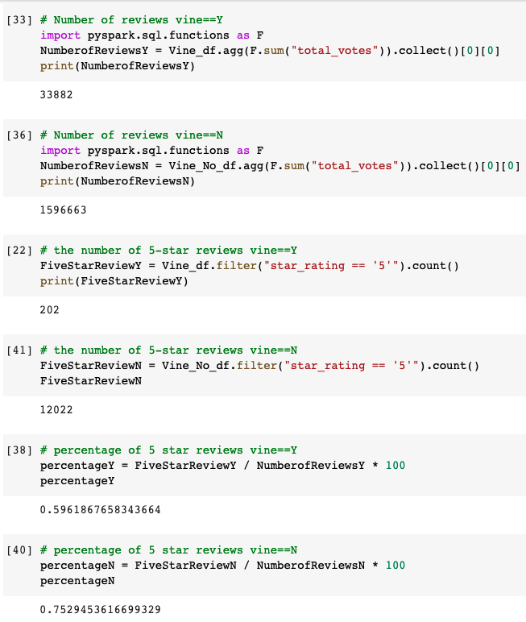

# Amazon_Vine_Analysis
## Overview of the analysis

### Purpose:
The purpose of this analysis was to take the data collected from the Amazon Vine program which mainly consisted of reviews and determine if members of the program demonstrated any bias when reviewing products. This analysis focused on the baby products data set. Companies send their products to Amazon Vine members in return for their reviews. 

## Results

- How many Vine reviews and non-Vine reviews were there?
Vine member reviews = 33882
Non-vine member reviews = 1596663

- How many Vine reviews were 5 stars? 
202

- How many non-Vine reviews were 5 stars?
12022

- What percentage of Vine reviews were 5 stars? 
.60%

- What percentage of non-Vine reviews were 5 stars?
.75%

 

## Summary: 

### Summary of the results
It appears that the 5 star ratings for both Vine members and non-members was under 1%.  Therefore, there appears to be no significant statistical difference.  However, the sample size used for this analysis was significantly higher for non-vine members (1596663) compared to vine members (12022) which could yield false results.  Based on these results, one additional analysis that could be conducted would be the need or benefit of the Vine program. It appears that customers are willing to provide reviews when they purchase items on amazon and the need for a program that could potentially introduce bias to the reviews should be evaluated. One way of evaluating this would be by analyzing the data across items and comparing the number of "natural" reviews with the reviews provided by the vine program. This analysis focused on baby products and may difer with other types of products sold on amazon. 

